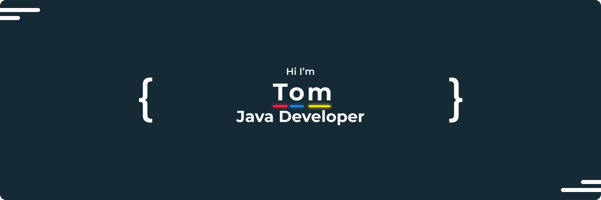

Hey there,

I'm Tom and I'm 26 years old. My passion is programming in Java, but I also have experience in web programming languages and design. On my GitHub profile, you can find projects that I've worked on as well as some useful libraries and tools that I've created. In my free time, I enjoy talking with other developers to expand my knowledge and discover new ideas.

# ✏️ Recent Repository Changes

# 📌 Pinned Repositorys

# 📊 GitHub Stats

# 💼 Skills

